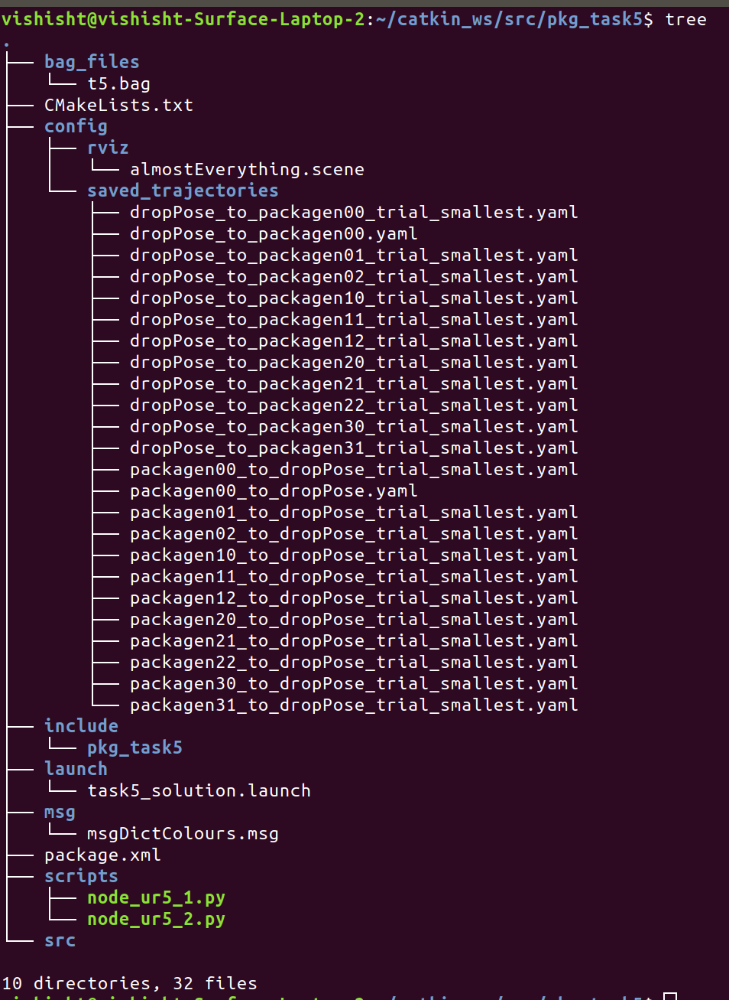
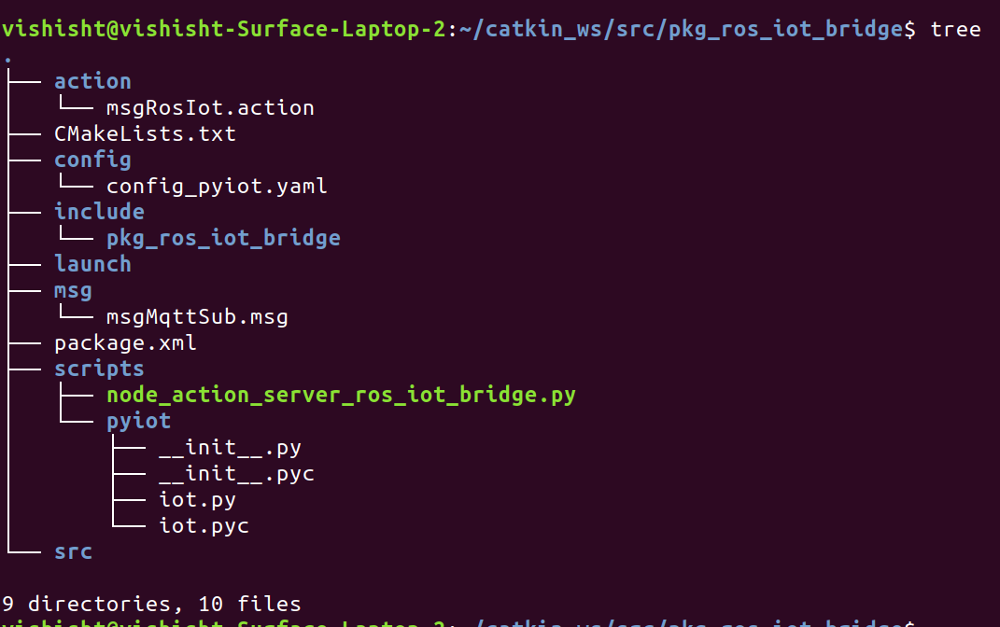

## 
<b>pkg_task5</b>

#### 
<b>Config:</b>

<b>Saved Trajectories</b>

&nbsp&nbsp&nbsp&nbspThis consists of all the most optimal files of the saved trajectories, which is used for the play function to replay the trajectories.

<b>Rviz</b>

&nbsp&nbsp&nbsp&nbspThis consists of the .scene files which were used for saving the trajectories to avoid collisions.

#### 
<b>t5.bag:</b>

&nbsp&nbsp&nbsp&nbspThis consists of the recorded bag file of the topics ‘/eyrc/vb/ur5_1/vacuum_gripper/logical_camera/ur5_1’ and ‘/eyrc/vb/ur5_2/vacuum_gripper/logical_camera/ur5_2’ which are recorded into the t5.bag file in which all the messages in these topics are saved.

#### 
<b>task5_solution.launch:</b>

&nbsp&nbsp&nbsp&nbspLaunch files provide us with the capability of launching ROS Master along with our project dependencies at once which running separately is a tedious task. In our case, along with ROS Master, we launch the world in Gazebo, 2 move groups of UR5_1 and UR5_2 in Rviz and the 3 nodes ‘node_ros_iot_action_bridge.py’, ‘node_ur5_1.py’ and ‘node_ur5_2.py’ which controls the individual actions. Also, this is used to record the bag file while the simulation runs in the background.

#### 
<b>msgDictColours.msg:</b>

&nbsp&nbsp&nbsp&nbspThis contains the message file which is used for two purposes.

&nbsp&nbsp&nbsp&nbspOne being it transfers the colours dictionary as detected by the camera_1 in between the 2 nodes. Two it will transfer the incoming orders between the nodes for processing of orders to execute them efficiently.

#### 
<b>node_ur5_1.py:</b>

This node contains the working of the UR5_1 arm and any other relevant funcitonalities.

#### <b>Functions</b>

<ul>

<li><b>send_inventory_to_ur5_2</b></li>

This function sends the list of incoming orders (a list of dictionaries) to the UR5_2 arm. This is done by publishing this list onto a ROS Topic which is then subscribed to by the node controlling the UR5_2 arm.

<li><b>priority_callback</b></li>

This is the callback function for the subscriber to the ROS Topic which receives the incoming orders from node_action_server_ros_iot_bridge.py

These incoming orders are stored as a list of dictionaries (each dictionary containing information about a single order).

A goal is then sent to the Action Server, which then leads to the relevant spreadsheet being updated.

<li><b>on_transition</b></li>  

This function is called when there is a change of state in the Action Client. That is, when the processing of a goal has started, or on the completion of a goal, this function is invoked. The relevant success/failure information is then printed to the console.

<li><b>got_the_colours</b></li>

This is the callback function for the subscriber to the ROS Topic which receives the inventory (details about each package on the shelf) as a dictionary from node_ur5_2.py as node_ur5_2.py publishes this information onto the relevant ROS Topic.

<li><b>service_activate_deactivate</b></li>

This function makes a ROS Service call to activate/deactivate the vacuum gripper.

<li><b>service_start_stop</b></li>

This function makes a ROS Service call to start/stop the conveyor belt.

<li><b>moveit_play_planned_path_from_file</b></li>

This function plays tractories stored in the YAML files.

<li><b>moveit_hard_play_planned_path_from_file</b></li>

This acts as a wrapper function for moveit_play_planned_path_from_file and calls this function until it is successful.

<li><b>pick_it_and_put_it</b></li>

This function executes a series of instructions which prompts the UR5_1 arm to go to a particular package on the shelf, pick it up, go to the conveyor belt, and drop it.

<li><b>set_joint_angles</b></li>

This function moves the UR5_1 arm to a particular set of joint angles.

<li><b>hard_set_joint_angles</b></li>

This function acts as a wrapper function for set_joint_angles and calls this function until it is successful.

</ul>

#### <b>Working</b>

&nbsp&nbsp&nbsp&nbspFirst the conveyor belt is started and the UR5_1 arm is moved to the drop position (position where it drops packages onto the conveyor belt). Then an infinite loop is constructed which continuously checks if all the incoming orders have been processed. The list of incoming orders is first sorted based on priority, then the one with the highest priority is processed, by executing the pick_it_and_put_it function for that particular package. Then the list is updated to remove the processed order. As each package is dispatched, a goal is sent to the Action Server which then leads to the relevant spreadsheet being updated.

#### 
<b>node_ur5_2.py:</b>

&nbsp&nbsp&nbsp&nbspThis node is used to control the ur5_2 arm, camera_1, priority ordering of orders, logical_camera and IOT based operations. To start off, we subscribe to ‘/ur5_1_to_ur5_2/inventory’ and ‘/eyrc/vb/logical_camera_2’ who subscribes to msgDictColours and LogicalCameraImage msgs respectively which is used to transfer the information between nodes. The initialisation is done with all the private variables which define the topic, publisher, subscribers, listener, home_pose, and other flag variables to indicate the competition of tasks.

&nbsp&nbsp&nbsp&nbspThe callback function is used to read the input of camera_1 which uses OpenCV to analyse the image. The input image is resized and segmented and the given as an input to the get_dominant_colour function. The get_dominant colour function is used to identify the most prominent colour in the input image. By using mean colours for values of blue, green and red. All these colours are then stored in a dict() for sending to the Google Spreadsheet and as a message to the other node. The orders received through the MQTT Topic are processed by the priority_callback function to append to a list to queue the orders for processing based on priority listing. The hard_set_joint_angles function is an extension of the set_joint_angles function which basically sets the joint angles of the UR5 arm without failing to do so because we give it multiple attempts to set it.

&nbsp&nbsp&nbsp&nbspThe service_start_stop is used to control the movement of the conveyor belt based on the power level. The service_activate_deactivate is used to control the vacuum gripper of the UR5 arm to grasp the package from the shelf and drop it in the bin OR pick it up from the conveyor and drop it into the bin. The pick_place_start function starts the operation of picking up the packages into the bin and place it into the conveyor and simultaneously update the dispatched/shipped flags onto the Spreadsheet and the completion flags in the program. The camera_callback is the callback function for the logical_camera which gets the package name, ex. ‘packagen00’ which helps to update the completion flags. The destructor is used to delete the class after the program objective has been completed.

## 
<b>pkg_ros_iot_bridge</b>

#### 
<b>msgRosIot.action:</b>

&nbsp&nbsp&nbsp&nbspThis is the action file which contains a protocol, mode, topic, message as a goal. It is through this goal that node_ur5_1.py and node_ur5_2.py prompt node_action_server_ros_iot_bridge.py to update relevant information to spreadsheets.

#### 
<b>config_pyiot.yaml:</b>

&nbsp&nbsp&nbsp&nbspThis is a config file that stores certain constants such as topic names, spreadsheet IDs, etc.

#### 
<b>msgMqttSub.msg:</b>

&nbsp&nbsp&nbsp&nbspThis is a message file that contains timestamp, topic, and message. It is over this message file that node_action_server_ros_iot_bridge.py send the incoming orders. The topic is subscribed by node_ur5_1.py.

#### 
<b>node_action_server_ros_iot_bridge.py:</b>

&nbsp&nbsp&nbsp&nbspThis node performs all ROS-IOT communications.

#### <b>Functions</b>

<ul>

<li><b>mqtt_sub_callback</b></li>

This is the callback function for when the MQTT Topic receives a message. This message is then sent over a ROS Topic to be accessed by node_ur5_1.py.

<li><b>on_goal</b></li>

This function is called when the Action Server receives a goal (sent either by node_ur5_1.py or node_ur5_2.py to update to spreadsheet). This validates the goal and then starts a thread to process it.

<li><b>process_goal</b></li>

When on_goal starts a thread to process a goal, this function is called. This function gets the goal and invokes the data_to_sheet function to update the spreadsheets.

<li><b>on_cancel</b></li>

This function is called when goal cancel request is sent to the action server.

<li><b>data_to_sheet</b></li>

This function updates the required spreadsheet depending on the value sent through the goal. It calculates all the required parameters and then sends it to the spreadsheet by performing a HTTP GET request.

</ul>
#### <b>Working</b>

&nbsp&nbsp&nbsp&nbspThis node performs all ROS-IOT communications.
It receives incoming orders through the MQTT Topic and sends it over a ROS Topic to other nodes.
It receives goals through action messages, send by other nodes, and processes these goals by updating relevant values onto the correct spreadsheets.

#### <b>pkg_task5 Tree</b>

#### <b>pkg_ros_iot_bridge Tree</b>
